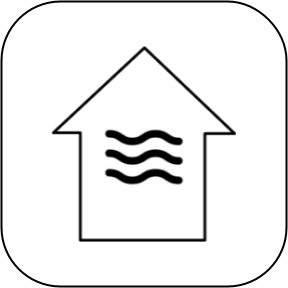

# IndoAir QM - TLA IoT BYOD 2022  



IndoAir QM is a small and simple device that could be placed inside of any room of a house. It will passively and continously monitor values such as temperature, humidity, pollution, and volatile organic compounds. It uses said values to calculate the indoor air quality. In case of poor indoor air quality, it will notify the user with information about how to adjust their environment for better air quality, which will help the user recieve health benefits of good indoor air quality, and live a more comfortable indoor lifestyle. This device records very simple values, but can go a very long way towards ensuring that indoor air quality does not become an issue in the user's homes and lifestyles, which can lead to many negative health implications, and an uncomfortable environment.

## Applications / Usefulness

With people spending a majority of their lives at home, and as poor indoor air quality is a large, but overlooked issue in todays society, IndoAir QM could be beneficial to anyone, but there is a bigger application. It can greatly benefit people with worsened breathing ability due to conditions such as asthma, heart disease, or COPD (chronic obstructive pulmonary disease). As poor air quality affects them more than anyone else, a device to monitor and report poor air quality becomes almost necessary. It can also help kids grow up in a more comfortable and safer environment, which will overall benefit their long-term health. 

## Device Replication

Here are step-by-step instructions on how to replicate the device.

### System Requirements
- **Operating Systems:** Windows 7 (or later), macOS, Linux
- USB Drivers
- 5 GB of RAM and 600 MB Available Disk Space
- Intel Pentium 4+
- A stable internet connection

### Installations
- Arduino IDE (Latest)
- Python (3.8+)
- Anaconda Distribution (Miniconda is untested but might work)

### Library and Board Installation
1. Install the following libraries in the Arduino IDE:
- [BME680](https://github.com/Zanduino/BME680)
- [BSEC Software Library](https://www.bosch-sensortec.com/software-tools/software/bsec/)
- [Sparkfun Qwiic OLED Graphics Library](https://github.com/sparkfun/SparkFun_Qwiic_OLED_Arduino_Library)

2. In the Arduino IDE, go to `File > Preferences` and under "Additional Board Manager URLs", and paste in this link: `https://raw.githubusercontent.com/espressif/arduino-esp32/gh-pages/package_esp32_index.json`

### Running the code

1. In the Arduino IDE, create a new sketch and paste the following code in: 
<details><summary>Expand to see code</summary>
<br>

```cpp
#include "Zanshin_BME680.h"  // Include Zanduino's BME680 Sensor library for BME68x control
#include "bsec.h" // Include Bosch's BSEC Fusion library for extra BME68x control
#include <SparkFun_Qwiic_OLED.h> // Include SparkFun's breakout OLED library with the QWIIC connect system

// Global variables
int bsecIAQ;
String AQissue;
String AQissueFixes;

const uint32_t SERIAL_SPEED{115200};  // Set the baud rate for Serial I/O

// Create an instance of the BME680 class
BME680_Class BME680;

//Forward function declaration with default value for sea level
float altitude(const int32_t press, const float seaLevel = 1013.25);
float altitude(const int32_t press, const float seaLevel) {
  static float Altitude;
  Altitude =
      44330.0 * (1.0 - pow(((float)press / 100.0) / seaLevel, 0.1903));  // Convert into meters
  return (Altitude);
}  

// Declare helper functions for BSEC library
void checkIaqSensorStatus(void);
void errLeds(void);

// Create an object of the BSEC class
Bsec iaqSensor;

// BSEC Variables
String output;

// Create an object of the QWIICMicroOLED class
QwiicMicroOLED myOLED;

void setup() {
  Serial.begin(SERIAL_SPEED);  // Start serial port at Baud rate
#ifdef __AVR_ATmega32U4__      // If this is a 32U4 processor, then wait 3 seconds to init USB port
  delay(3000);
#endif
  Serial.print(F("Starting air quality monitoring program\n"));
  Serial.print(F("- Initializing BME688\n"));
  while (!BME680.begin(I2C_STANDARD_MODE)) {  // Start BME680 using I2C, use first device found
    Serial.print(F("-  Unable to find BME680. Trying again in 5 seconds.\n"));
    delay(5000);
  }  // of loop until device is located
  Serial.print(F("- Setting 16x oversampling for all sensors\n"));
  BME680.setOversampling(TemperatureSensor, Oversample16);  // Use enumerated type values
  BME680.setOversampling(HumiditySensor, Oversample16);     // Use enumerated type values
  BME680.setOversampling(PressureSensor, Oversample16);     // Use enumerated type values
  Serial.print(F("- Setting IIR filter to a value of 4 samples\n"));
  BME680.setIIRFilter(IIR4);  // Use enumerated type values
  Serial.print(F("- Setting gas measurement to 320\xC2\xB0\x43 for 150ms\n"));  // "C" symbols
  BME680.setGas(320, 150);  // 320c for 150 milliseconds

  Wire.begin();

  iaqSensor.begin(BME680_I2C_ADDR_PRIMARY, Wire);
  output = "\nBSEC Library Version " + String(iaqSensor.version.major) + "." + String(iaqSensor.version.minor) + "." + String(iaqSensor.version.major_bugfix) + "." + String(iaqSensor.version.minor_bugfix);
  Serial.println(output);
  checkIaqSensorStatus();

  bsec_virtual_sensor_t sensorList[2] {
    BSEC_OUTPUT_IAQ,
    BSEC_OUTPUT_BREATH_VOC_EQUIVALENT,
  };

  iaqSensor.updateSubscription(sensorList, 2, BSEC_SAMPLE_RATE_LP);
  checkIaqSensorStatus();

  // Print the header
  output = "IAQ, breath VOC equivalent";
  Serial.println(output);

  if (myOLED.begin() == false) {
    Serial.println("OLED Initialization Failed - Freezing");
    while (true);
  }
  
  Serial.println("OLED Initialization Success");
  Serial.println();

  write("Loading");

}  // of method setup()

void loop() {
  int breezeIAQI;
  static int temp, humidity, pressure, gas;  // Assign variables for BME readings
  
  BME680.getSensorData(temp, humidity, pressure, gas);  // Get readings

  // Serial.println("Temperature: " + String((temp/100) - 3) + "° C"); COMMENTED OUT OF SERIAL MONITOR DATA PRINT DUMP
  // Serial.println("Relative Humidity: " + String(humidity/1000) + "%"); COMMENTED OUT OF SERIAL MONITOR DATA PRINT DUMP
  
  int tempIAQI = (temp/100) - 3;  
  int humiIAQI = humidity/1000;

  // Round the humidity to 10 for use with the chart 
  int humiLastDigit = humiIAQI % 10;
  if (humiLastDigit > 4) {
    humiIAQI = humiIAQI + (10 - humiLastDigit);
  } else if (humiLastDigit < 5) {
    humiIAQI = humiIAQI - humiLastDigit;
  }
  
  // Cross values against a chart by Breeze Technologies (DE) for an IAQI rating of 1 - 6, a number < 4 is good IAQI rating, otherwise poor IAQI rating
  if (tempIAQI < 18 || tempIAQI > 25 || humiIAQI < 40 || humiIAQI > 90 || tempIAQI == 18 && humiIAQI == 40 || tempIAQI == 19 && humiIAQI == 40 || tempIAQI == 18 && humiIAQI == 50 || tempIAQI == 18 && humiIAQI == 90|| tempIAQI == 23 && humiIAQI == 90 || tempIAQI == 24 && humiIAQI == 80 || tempIAQI == 24 && humiIAQI == 90 || tempIAQI == 25 && humiIAQI == 70 || tempIAQI == 25 && humiIAQI == 80) {
    // Serial.println("IAQI is Poor"); COMMENTED OUT OF SERIAL MONITOR DATA PRINT DUMP
    breezeIAQI = 0;
  } else {
    // Serial.println("IAQI is Good"); COMMENTED OUT OF SERIAL MONITOR DATA PRINT DUMP
    breezeIAQI = 1;
  }

  unsigned long time_trigger = millis();
  if (iaqSensor.run()) { // If new data is available
    output = "Time: " + String(time_trigger);
    output += ", IaQ: " + String(iaqSensor.iaq);
    output += ", b-VOC: " + String(iaqSensor.breathVocEquivalent);
    // Serial.println(output); COMMENTED OUT OF SERIAL MONITOR DATA PRINT DUMP

    if (iaqSensor.iaq < 25) {
      bsecIAQ = 0; // Amazing IAQ
      // Serial.println("IAQ (Not Temp/Humi Dependant) is Amazing"); COMMENTED OUT OF SERIAL MONITOR DATA PRINT DUMP
    } else if (iaqSensor.iaq > 24 && iaqSensor.iaq < 251) {
      bsecIAQ = 1; // Good IAQ
      //Serial.println("IAQ (Not Temp/Humi Dependant) is Good"); COMMENTED OUT OF SERIAL MONITOR DATA PRINT DUMP
    } else if (iaqSensor.iaq > 250 && iaqSensor.iaq < 501) {
      bsecIAQ = 2; // Poor IAQ
      //Serial.println("IAQ (Not Temp/Humi Dependant) is Poor"); COMMENTED OUT OF SERIAL MONITOR DATA PRINT DUMP
    } else {
      bsecIAQ = 3; // Error 
      //Serial.println("IAQ (Not Temp/Humi Dependant) is: ERROR"); COMMENTED OUT OF SERIAL MONITOR DATA PRINT DUMP
    }
  } else {
    checkIaqSensorStatus();
  }

  if (breezeIAQI == 1) {
    if (bsecIAQ == 0 || bsecIAQ == 1) {
      doubleWrite("AQ is Very", "Good, Safe");
    } else if (bsecIAQ == 2) {
      doubleWrite("AQ is Good", "Some VOCs");
    } else {
      doubleWrite("Error in", "Reading AQ");
    }
  } else if (breezeIAQI == 0) {
    if (bsecIAQ == 0 || bsecIAQ == 1) {
      doubleWrite("AQ is Poor,", "No VOCs");
    } else if (bsecIAQ == 2) {
      doubleWrite("AQ is", "Very Poor");
    } else {
      doubleWrite("Error in", "Reading AQ");
    }
  } else {
    doubleWrite("Error in", "Reading AQ");
  }

  // Detecting issue in AQ
  if (tempIAQI < 18 && humiIAQI > 94) {
    AQissue = "Too Cold and Too Humid";
    AQissueFixes = "Use a heater or air conditioner to heaten the area and bring down the humidity";
  } else if (tempIAQI < 18) {
    AQissue = "Too Cold";
    AQissueFixes = "Use a heater or turn off AC/fans/anything cooling the area";
  } else if (tempIAQI > 25 && humiIAQI > 94) {
    AQissue = "Too Hot and Too Humid";
    AQissueFixes = "Use an air conditioner to dry out the air and circulate cold air";
  } else if (tempIAQI > 25) {
    AQissue = "Too Hot";
    AQissueFixes = "Use AC/fans to circulate more cold air";
  } else if (humiIAQI > 94) {
    AQissue = "Too Humid";
    AQissueFixes = "Run a heater or air conditioner which will dry out the air in your area";
  } else if (humiIAQI < 35) {
    AQissue = "Not Humid Enough";
    AQissueFixes = "Use a vaporizer, steam machine, or humidifier to raise humidity and moisture";
  } else if (tempIAQI == 25 && humiIAQI > 64 || tempIAQI == 24 && humiIAQI > 75) {
    AQissue = "Too Hot and Too Humid";
    AQissueFixes = "Use an air conditioner to dry out the air and circulate cold air";
  } else if (tempIAQI == 23 && humiIAQI > 85) {
    AQissue = "Too Humid";
    AQissueFixes = "Run a heater or air conditioner which will dry out the air in your area";
  } else if (tempIAQI == 18 && humiIAQI < 55) {
    AQissue = "Too Cold and Not Humid Enough";
    AQissueFixes = "Use humidifers/heaters or try to tackle the issues one-by-one";
  } else if (tempIAQI == 18 && humiIAQI > 84) {
    AQissue = "Too Cold and Too Humid";
    AQissueFixes = "Use a heater to heat up the air and dry it out at the same time";
  } else if (tempIAQI == 19 && humiIAQI == 40) {
    AQissue = "Not Humid Enough";
    AQissueFixes = "Use a vaporizer, steam machine, or humidifier to raise humidity and moisture";
  } else {
    AQissue = "No Issue with Air Quality";
    AQissueFixes = "No issue to fix";
  }

  // Serial.println("Air Quality Issue: " + String(AQissue)); COMMENTED OUT OF SERIAL MONITOR DATA PRINT DUMP
  // Serial.println("AQ Issue Fixes: " + AQissueFixes); COMMENTED OUT OF SERIAL MONITOR DATA PRINT DUMP

  Serial.println(String(AQissue));
  
  // Serial.println(); COMMENTED OUT OF SERIAL MONITOR DATA PRINT DUMB
  delay(10000);
}  // of method loop()

void write(String str) {
  int intStringWidth, intStringHeight;
  
  myOLED.erase();

  intStringWidth = (myOLED.getWidth() - myOLED.getStringWidth(str)) / 2;
  intStringHeight = (myOLED.getHeight() - myOLED.getStringHeight(str)) / 2;

  myOLED.text(intStringWidth, intStringHeight, str, 1);
  myOLED.display();
} // of method write()

void doubleWrite(String one, String two) {
  int x0, y0, x1, y1;

  myOLED.erase();

  myOLED.text(0, 16, one, 1);
  myOLED.text(0, 26, two, 1);

  myOLED.display();
} // of method doubleWrite()

void checkIaqSensorStatus(void) {
  if (iaqSensor.status != BSEC_OK) {
    if (iaqSensor.status < BSEC_OK) {
      output = "BSEC error code : " + String(iaqSensor.status);
      Serial.println(output);
      for (;;)
        errLeds(); /* Halt in case of failure */
    } else {
      output = "BSEC warning code : " + String(iaqSensor.status);
      Serial.println(output);
    }
  }

  if (iaqSensor.bme680Status != BME680_OK) {
    if (iaqSensor.bme680Status < BME680_OK) {
      output = "BME680 error code : " + String(iaqSensor.bme680Status);
      Serial.println(output);
      for (;;)
        errLeds(); /* Halt in case of failure */
    } else {
      output = "BME680 warning code : " + String(iaqSensor.bme680Status);
      Serial.println(output);
    }
  }
} // of method checkIaqSensorStatus()

void errLeds(void) {
  pinMode(LED_BUILTIN, OUTPUT);
  digitalWrite(LED_BUILTIN, HIGH);
  delay(100);
  digitalWrite(LED_BUILTIN, LOW);
  delay(100);
} // of method errLeds()
```
</details>

The code can also be downloaded from within this GitHub repository.

Upload this to the Arduino device (which must have a QWIIC connect circuit of `ESP32 Thing Plus > BME688 > Micro OLED Breakout` where `>` is a QWIIC connect cable).

Once it is running, open the Anaconda Prompt and one by one, run the following lines. Once you run a line, wait for it to finish before running the next. These are the lines to run:

```cmd
conda create -y -n arduino python=3.8

conda activate arduino

conda install pyserial

pip install discord-webhook

cd Downloads

python COMextract.py
```

Before running this, make sure that you create a file called `COMextract.py` in the `Downloads\` folder on your PC, and its contents are the code in the dropdown below. Alternatively, you can download the file from this GitHub repository (but remember to move it to your `Downloads/` folder). If you want to move it to another folder, reflect that in the `cd ...` line. For example, if you want to put it in a folder within your `Desktop/` folder called `Arduino`, you would replace that line with `cd Desktop/Arduino`. Here is the code to include in `COMextract.py`:

<details><summary>Expand to see code</summary>

```py
import code
from xml.etree.ElementTree import tostring
import serial
import time
from discord_webhook import DiscordWebhook, DiscordEmbed

ser = serial.Serial('COM3',115200)
time.sleep(2);

while True:
    
    line = ser.readline()
    if line:
        string = line.decode()

        # Value "string" is the now the AQissue

        if string == "No Issue with Air Quality":
            issueFix = "N/A"
            isIssue = False
        elif string == "Too Cold and Too Humid":
            issueFix = "Use a heater or air conditioner to heaten the area and bring down the humidity"
            isIssue = True
        elif string == "Too Cold":
            issueFix = "Use a heater or turn off AC/fans/anything cooling the area"
            isIssue = True
        elif string == "Too Hot and Too Humid":
            issueFix = "Use an air conditioner to dry out the air and circulate cold air"
            isIssue = True
        elif string.startswith("Too Hot"):
            issueFix = "Use AC/fans to circulate more cold air"
            isIssue = True
        elif string == "Too Humid":
            issueFix = "Run a heater or air conditioner which will dry out the air in your area"
            isIssue = True
        elif string == "Not Humid Enough":
            issueFix = "Use a vaporizer, steam machine, or humidifier to raise humidity and moisture"
            isIssue = True
        elif string == "Too Cold and Not Humid Enough":
            issueFix = "Use humidifers/heaters or try to tackle the issues one-by-one"
            isIssue = True
        else:
            issueFix = "N/A"
            isIssue = False

        print(string)

        if isIssue == True:
            webhook = DiscordWebhook("Discord Webhook URL", content="There is an issue with the indoor air quality! See the embed attached to this message for more information ASAP.")
            embed = DiscordEmbed(title="Issue with Indoor Air Quality", description="There is an issue with the indoor air quality! Here is the information:\n\n**ISSUE:** " + string + "\n**SOLUTION TO FIX ISSUE: **" + issueFix + "\n\nTry to solve this issue quickly before the situation gets worse. If you are not able to implement the solution recommended above, refer to [this](https://www.servicefirstprosllc.com/expert-tips/ways-to-raise-or-lower-your-homes-humidity/) website for information on adjusting humidity, and try to do the solutions that will fix both the bad humidity levels and the bad temperature levels (if applicable).", color="00bcff")
            webhook.add_embed(embed)
            response = webhook.execute()
            print(response)

        string = line.decode()

ser.close()
```
</details>

**IMPORTANT:** You must create a webhook in a Discord channel of some server by going to `Channel Settings > Integrations > Webhooks` and create a webhook. Copy the webhook URL, and in the Python code on line 49, replace "Discord Webhook URL" with the webhook URL, which will look something similar to this URL: `https://discord.com/api/webhooks/1004349023488278548/W9ddoCTbzLq3EhHsab8ibk5ISfvj43XLm96dCmCixxw3BnXTb1VF6Q4T4CSBP6FtbD4E` 

Upon completing this, after running `python COMextract.py` in the Anaconda Prompt, if the air quality is poor, you will recieve notifications on Discord, and you will also be able to check the Micro OLED Display for quick information about the air quality.

One more thing, when installing `pyserial` with `conda install pyserial`, it will ask you if you want to install the packages and list them before installing. Simply type `y` on your keyboard and press enter to continue the installation.

With that, the device should be fully setup and ready to go!

## Presentation
For information about the project and the device creation journey, please read through the presentation located [here](https://docs.google.com/presentation/d/1w7gI2e2EuELESHTuLNf1z_Qsl5Gs2N236A_orpxagPE/edit?usp=sharing). It will also contain a demonstration of the device.

## Conclusion
Overall, this project was very fun and I learnt a lot. The final device worked well and even helped me adjust the environment in my very own rooms, and everything turned out to be very accurate and helpful. I hope to continue working on this project and add new features such as a gas trend detecting system and a 3D-printable casing for the device in the future. Along with working on my project, I had a lot of fun helping many others with their projects and the issues they faced.